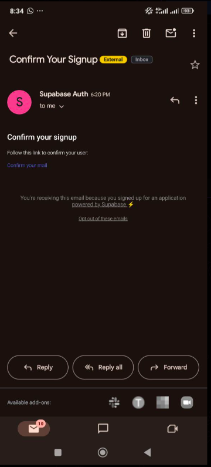
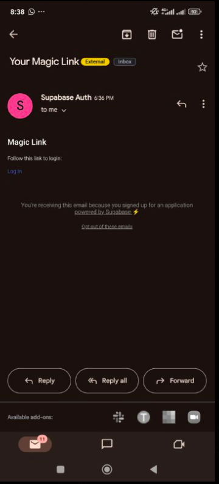

# MULTI-AUTHENTICATION IMPLEMENTATION

### WHAT I HAVE DONE
I have successfully implemented multiple authentication methods in my application using Supabase as the backend authentication service. The implementations include:

- Email/Password Authentication: Created a system allowing users to sign up with email and password, with appropriate error handling and loading states.
- Magic Link Authentication: Added passwordless authentication using Magic Links sent to users' email addresses, providing an alternative and more convenient way to authenticate.
- Authentication UI: Developed a clean, user-friendly interface that allows users to switch between different authentication methods.
- Session Management: Implemented session handling to maintain user state across the application, ensuring that users remain logged in until they explicitly log out.

### WHAT I HAVE LEARNT
Through this implementation, I have gained valuable knowledge:

- Supabase Authentication API: I learned how to work with Supabase's authentication methods, including signInWithPassword, signUp, and signInWithOtp for Magic Links.
- React Native State Management: I improved my understanding of using React hooks like useState and useEffect to manage application state and component lifecycle.
- UI Component Design: I gained experience in creating toggle mechanisms for different authentication methods and designing responsive input fields.
- Async Operations: I learned how to properly handle asynchronous operations with proper loading states and error handling.
- TypeScript Integration: I gained practical experience with TypeScript for type-checking props and implementing type-safe error handling.

### WHAT CHALLENGES I HAVE FACED

During the implementation, I encountered several challenges:

- Understanding Supabase Authentication Flow: Initially, I had difficulty understanding how different authentication methods work with Supabase and how to properly implement them in React Native.
- Error Handling: Properly managing errors from authentication API calls and displaying meaningful messages to users required attention to detail.
- UI/UX Decisions: Designing an interface that would be intuitive for users while allowing them to switch between authentication methods was challenging.
- TypeScript Type Definitions: Working with TypeScript's type system, especially for third-party libraries like Supabase, presented some learning curves.

### HOW DID I OVERCOME
I used several strategies to overcome these challenges:

- Documentation Research: I spent considerable time reading through Supabase documentation and React Native guidelines to understand best practices.
- Step-by-Step Testing: I broke down the implementation into smaller steps and tested each functionality thoroughly before moving on to the next feature.
- Community Resources: I referred to community forums, Stack Overflow, and GitHub discussions to understand common patterns and solutions for authentication implementations.
- Debugging Techniques: I improved my debugging skills by using console logs, React Native Debugger, and TypeScript error messages to identify and fix issues.
- Incremental Development: I adopted an incremental approach, starting with basic email/password authentication before adding more complex features like Magic Links.
- Code Refactoring: I continuously refactored my code to improve readability, maintainability, and performance as I better understood the authentication flow.

This project has significantly enhanced my skills in implementing secure authentication systems in applications and has provided me with valuable experience in working with modern authentication services like Supabase.

